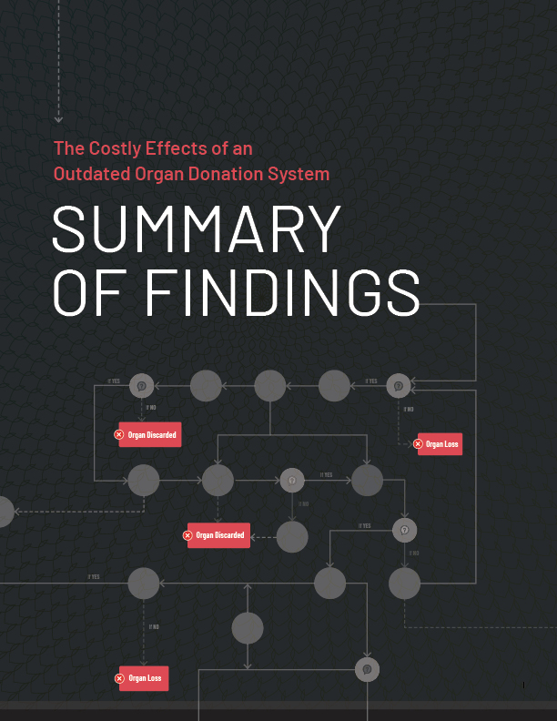

# Introduction

The U.S. could save thousands of lives and $40 billion in taxpayer money over the next decade if it fixed what was broken in the organ donation system.

Despite scientific advancements, the organ donation system is held back by poor management and performance.

Bloom Works investigated and analyzed the current organ donation system through interviews, case studies, and existing research. These reports outline what we found, and what recommendations we have for improving the system.

## Where to start? 

<!-- 
 -->
We recommend reading through our Summary of Findings [here](/Summary) (or you can [read the printable PDF version here](/assets/PDF/ODR_Summary.pdf)).

You can also view our more comprehensive reports with specific areas of focus, such as [Inequity in Organ Donation](/Inequity), [OPO Best Practices](/OPO-Best-Practices), [Technology Recommendations](/Technology), and [Acquisition Strategy for OPTN Tech](/Acquisition-Strategy). If you want to see all the maps and charts to explain the process, they are all in one place in the [appendix](/appendix). 

[This entire report is on github](https://github.com/Bloom-Works/organ-donation-reform). You can read, download source files, and contribute.
